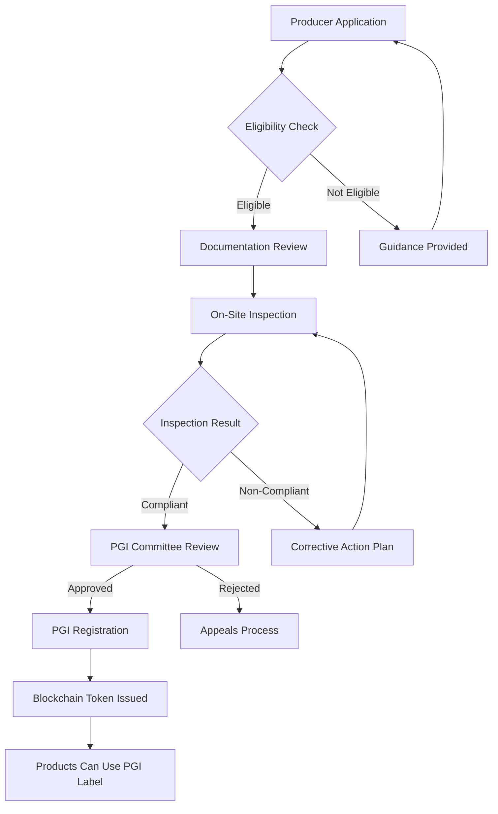

# AlgeriaTrack.dz Blockchain Pilot - Agricultural Industry Guide

## Guide d'Intégration pour le Secteur Agricole Algérien

**Industry:** Agriculture (Dates, Olive Oil, Citrus, Cereals)  
**Target Regions:** Biskra, Touggourt, Tizi Ouzou, Bejaia, Mila, Mascara  
**Regulatory Body:** ONSSA (Office National de Sécurité Sanitaire des Produits Alimentaires)  
**Template Version:** 1.0

---

## Table of Contents

1. [Executive Summary](#executive-summary)
2. [Algerian Agriculture Overview](#algerian-agriculture-overview)
3. [Date Production Guide (Biskra/Touggourt)](#date-production-guide-biskratouggourt)
4. [Olive Oil Production Guide (Tizi Ouzou/Bejaia)](#olive-oil-production-guide-tizi-ouzoubejaia)
5. [Organic Certification Integration](#organic-certification-integration)
6. [PGI/Origin Labeling](#pgiorigin-labeling)
7. [Export Documentation](#export-documentation)
8. [Sample Data Structures](#sample-data-structures)
9. [Cooperative Management Features](#cooperative-management-features)
10. [Pricing for Full Rollout](#pricing-for-full-rollout)

---

## Executive Summary

### Why Blockchain for Algerian Agriculture?

The Algerian agricultural sector, particularly date production and olive oil, has immense export potential that blockchain technology can unlock:

| Challenge | Traditional Approach | Blockchain Solution |
|-----------|---------------------|---------------------|
| **Origin Fraud** | Paper certificates easily forged | Cryptographic proof of origin |
| **Organic Certification Trust** | Consumers skeptical of claims | Verifiable certification trail |
| **Export Market Access** | Complex documentation requirements | Automated compliance documentation |
| **Price Premium Capture** | Difficulty proving quality | QR-verified premium products |
| **Supply Chain Visibility** | Limited traceability for buyers | Complete journey from farm to shelf |

### Key Statistics - Algerian Date Industry

```
Annual Production: ~100,000+ tonnes (varies by year)
Main Varieties: Deglet Nour (70%), Ghars, Tenicin, Mech Degla
Primary Regions: Biskra (50%), Touggourt, Ouargla, Ghardaïa
Export Markets: EU (France, Spain), Africa, Middle East
Export Volume: ~15,000 tonnes/year
Unit Value: Premium dates can command 3-5x conventional prices
Employment: Directly supports 100,000+ families
ONSSA Organic Certified: Growing rapidly
```

---

## Algerian Agriculture Overview

### Major Agricultural Regions

```
┌─────────────────────────────────────────────────────────────┐
│                  ALGERIA AGRICULTURAL MAP                   │
├─────────────────────────────────────────────────────────────┤
│                                                              │
│   NORTH (Mediterranean)                                     │
│   ┌─────────────────────────────────────────┐              │
│   │  Tizi Ouzou ◄── Olive Oil              │              │
│   │       Bejaia ◄── Citrus Fruits          │              │
│   │       Skikda ◄── Various                │              │
│   └─────────────────────────────────────────┘              │
│                                                              │
│   SAHARA (Oases)                                             │
│   ┌─────────────────────────────────────────┐              │
│   │  Biskra ★ ─── Dates Capital            │              │
│   │     │                                   │              │
│   │     ├── Tolga ─── Deglet Nour          │              │
│   │     ├── Ouled Djellal                 │              │
│   │     └── Sidi Okba                     │              │
│   │                                       │              │
│   │  Touggourt ◄── Ghars Dates             │              │
│   │  Ouargla ◄── Various                  │              │
│   │  Ghardaïa ◄── Beni Isguen             │              │
│   └─────────────────────────────────────────┘              │
│                                                              │
│   HIGHLANDS                                                   │
│   ┌─────────────────────────────────────────┐              │
│   │  Mila ◄── Cereals                       │              │
│   │  Mascara ◄── Fig Products               │              │
│   │  Relizane ◄── Various                    │              │
│   └─────────────────────────────────────────┘              │
│                                                              │
└─────────────────────────────────────────────────────────────┘
```

---

## Date Production Guide (Biskra/Touggourt)

### The Biskra Date Ecosystem

Biskra Wilaya is the heart of Algeria's date industry:

```typescript
interface DateProductionRegion {
  region: 'Biskra';
  wilayaCode: '07';
  coordinates: { lat: 34.8146, lng: 5.0654 };
  
  // Production Statistics
  annualProductionTonnes: number;  // Varies 40,000-80,000
  palmTreeCount: number;           // ~500,000+
  farmerCount: number;            // ~30,000 families
  
  // Main Communes for Dates
  communes: Array<{
    name: string;
    arabicName: string;
    specialization: string;
    estimatedProduction: number;
  }>;
  
  // Processing Facilities
  processingUnits: Array<{
    name: string;
    type: 'washing' | 'sorting' | 'packaging' | 'export';
    capacity: string;
    certifications: string[];
  }>;
}

const biskraRegion: DateProductionRegion = {
  region: 'Biskra',
  wilayaCode: '07',
  coordinates: { lat: 34.8146, lng: 5.0654 },
  annualProductionTonnes: 55000,
  palmTreeCount: 520000,
  farmerCount: 32000,
  
  communes: [
    { name: 'Tolga', arabicName: 'تولقة', specialization: 'Deglet Nour', estimatedProduction: 15000 },
    { name: 'Ouled Djellal', arabicName: 'أولاد جلال', specialization: 'Deglet Nour + Ghars', estimatedProduction: 12000 },
    { name: 'Sidi Okba', arabicName: 'سيدي عقبة', specialization: 'Deglet Nour Premium', estimatedProduction: 8000 },
    { name: 'Biskra City', arabicName: 'بسكرة', specialization: 'Trading & Export', estimatedProduction: 0 },
    { name: 'Doucen', arabicName: 'دوسن', specialization: 'Mixed varieties', estimatedProduction: 6000 },
    { name: 'Oumache', arabicName: 'أماش', specialization: 'Ghars', estimatedProduction: 4000 }
  ],
  
  processingUnits: [
    {
      name: 'Biskra Date Washing Station',
      type: 'washing',
      capacity: '50 tonnes/day',
      certifications: ['ISO-22000', 'HACCP']
    },
    {
      name: 'Tolga Sorting & Packaging Unit',
      type: 'sorting',
      capacity: '30 tonnes/day',
      certifications: ['GlobalGAP', 'Organic']
    },
    {
      name: 'Biskra Export Center',
      type: 'export',
      capacity: '20 containers/month',
      certifications: ['IFS', 'BRC']
    }
  ]
};
```

### Date Quality Grades

Algerian dates are classified into specific grades affecting price and market access:

```typescript
type DateGrade = 
  | 'EXTRA'        // Perfect appearance, no defects, uniform color
  | 'CLASS_A'      // Minor cosmetic defects allowed (<5%)
  | 'CLASS_B'      // More defects tolerated, for processing
  | 'CLASS_C'      // Industrial use, animal feed
  | 'INDUSTRIAL';  // By-products, processing waste

interface DateQualitySpecs {
  grade: DateGrade;
  moistureContent: { min: number; max: number };  // %
  sizeRange: string;                             // e.g., "Large (>20mm)"
  color: string;                                  // e.g., "Amber/Golden"
  defectsAllowed: number;                         // %
  sugarContent?: number;                          // Brix
  intendedMarket: 'export_premium' | 'export_standard' | 'local' | 'industrial';
}
```

### Harvest Tracking Workflow

```
FARM LEVEL
┌─────────────────────────────────────────────────────────────┐
│  HARVEST REGISTRATION                                      │
│  • Farmer ID verification                                  │
│  • Plot/Palm Tree identification                           │
│  • Variety declaration (Deglet Nour, Ghars, etc.)         │
│  • Estimated quantity                                     │
│  • Harvest date/time                                      │
│                                                             │
│  Event Type: HARVEST                                       │
│  Data: { farmerId, plotId, variety, quantityEstimate }     │
└─────────────────────────────────────────────────────────────┘
                              │
                              ▼
RECEIVING STATION
┌─────────────────────────────────────────────────────────────┐
│  DATE RECEIVING                                            │
│  • Weigh incoming lots                                    │
│  • Visual quality inspection                               │
│  • Sample collection for lab testing                      │
│  • Initial grade assignment                               │
│  • Issue receiving ticket with unique lot ID             │
│                                                             │
│  Event Type: WAREHOUSE_IN (Raw Material)                  │
│  Data: { lotId, weightReceived, initialGrade, supplier }   │
└─────────────────────────────────────────────────────────────┘
                              │
                              ▼
PROCESSING FACILITY
┌─────────────────────────────────────────────────────────────┐
│  WASHING & PROCESSING                                      │
│  • Track batch through washing stages                     │
│  • Record water temperature and duration                  │
│  • Monitor chemical treatments (if any)                   │
│  • Output: Cleaned, sorted dates                           │
│                                                             │
│  Event Types: WASHING, SORTING, GRADING                   │
│  Data: { inputLotId, outputLots[], processParams }         │
└─────────────────────────────────────────────────────────────┘
                              │
                              ▼
PACKAGING
┌─────────────────────────────────────────────────────────────┐
│  PACKAGING OPERATIONS                                      │
│  • Grade-based packaging lines                            │
│  • Package type assignment (carton, vacuum, gift)         │
│  • Label printing with blockchain QR                       │
│  • Final QC before sealing                                │
│                                                             │
│  Event Type: PACKAGING                                     │
│  Data: { batchId, packageType, unitsPerPackage, grade }    │
└─────────────────────────────────────────────────────────────┘
                              │
                              ▼
EXPORT/DISTRIBUTION
┌─────────────────────────────────────────────────────────────┐
│  SHIPMENT PREPARATION                                      │
│  • Phytosanitary certificate linkage                      │
│  • Export documentation generation                         │
│  • Container loading verification                        │
│  • Cold chain monitoring (if refrigerated)                │
│                                                             │
│  Event Types: CUSTOMS, TRANSPORT, DISTRIBUTION_CENTER     │
│  Data: { shipmentId, destinationCountry, containerNo }    │
└─────────────────────────────────────────────────────────────┘
```

---

## Olive Oil Production Guide (Tizi Ouzou/Bejaia)

### Kabylie Olive Oil Region

```typescript
interface OliveOilRegion {
  region: 'Kabylie';
  mainWilayas: ['15', '06'];  // Tizi Ouzou, Bejaia
  coordinates: { tiziOuzou: { lat: 36.5678, lng: 4.0556 }, bejaia: { lat: 36.7200, lng: 5.0600 } };
  
  oliveVarieties: Array<{
    name: string;
    nameArabic: string;
    oilCharacteristics: string;
    percentageOfProduction: number;
  }>;
  
  productionStats: {
    annualOilProductionLitres: number;
    oliveTreesCount: number;
    millsCount: number;
    averageYield: string;  // liters per tree
  };
  
  certifications: Array<{
    name: string;
    issuingBody: string;
    benefits: string;
  }>;
}

const kabylieOliveRegion: OliveOilRegion = {
  region: 'Kabylie',
  mainWilayas: ['15', '06'],
  coordinates: { 
    tiziOuzou: { lat: 36.5678, lng: 4.0556 }, 
    bejaia: { lat: 36.7200, lng: 5.0600 } 
  },
  
  oliveVarieties: [
    {
      name: 'Chemlal de Kabylie',
      nameArabic: 'شملال القبائلي',
      oilCharacteristics: 'Fruity, slightly peppery, golden-green color',
      percentageOfProduction: 65
    },
    {
      name: 'Sigoise',
      nameArabic: 'سيقويس',
      oilCharacteristics: 'Mild, sweet, stable',
      percentageOfProduction: 20
    },
    {
      name: 'Azeradj',
      nameArabic: 'أزراج',
      oilCharacteristics: 'Robust, high polyphenols',
      percentageOfProduction: 10
    },
    {
      name: 'Limli',
      nameArabic: 'لملي',
      oilCharacteristics: 'Dual-purpose (table + oil)',
      percentageOfSelection: 5
    }
  ],
  
  productionStats: {
    annualOilProductionLitres: 25000000,  // 25 million liters
    oliveTreesCount: 12000000,          // 12 million trees
    millsCount: 850,
    averageYield: '2-3 liters/tree'
  },
  
  certifications: [
    {
      name: 'PGI "Huile d'Olive de Kabylie"',
      issuingBody: 'INAO France / ONSSA Algeria',
      benefits: 'EU market access, price premium 20-40%'
    },
    {
      name: 'Organic (AB/Bio)',
      issuingBody: 'ECOCERT / ONSSA',
      benefits: 'Growing organic market, health-conscious consumers'
    },
    {
      name: 'AOP (Appellation d\'Origine Protégée)',
      issuingBody: 'Ministry of Agriculture',
      benefits: 'Geographic indication protection'
    }
  ]
};
```

### Olive Oil Classification

```typescript
type OliveOilCategory =
  | 'EVOO_EXTRA_VIRGIN'    // < 0.8% acidity, perfect taste
  | 'EVOO_VIRGIN'          // < 2.0% acidity, good taste
  | 'VIRGIN'               // < 3.3% acidity
  | 'LAMPANTE'             // > 3.3% acidity, for refining
  | 'REFINED'              // Chemically processed
  | 'POMACE';              // From remaining paste

interface OliveOilBatch {
  // Basic Info
  batchId: string;
  millId: string;
  millName: string;
  location: {
    commune: string;
    daira: string;
    wilaya: string;
    coordinates: { lat: number; lng: number };
  };
  
  // Oil Characteristics
  category: OliveOilCategory;
  variety: string;                    // e.g., "Chemlal"
  harvestYear: string;
  extractionDate: string;
  extractionMethod: 'traditional_press' | 'continuous_system' | 'superior_continuous';
  
  // Quality Parameters (lab tested)
  qualityParams: {
    freeAcidity: number;              // % oleic acid
    peroxideValue: number;           // meq O2/kg
    k232: number;                     // UV absorption
    k270: number;                     // UV oxidation
    sensoryScore?: number;            // Panel test score (if done)
    defects?: string[];               // Sensory defects found
  };
  
  // Origin Traceability
  origin: {
    olivesSource: string;             // Specific grove or cooperative
    farmerIds: string[];              // Contributing farmers
    deliveryTickets: string[];       // Olive delivery receipts
    totalOlivesWeightKg: number;
    yieldPercentage: number;          // Liters per 100kg olives
  };
  
  // Certifications
  certifications: Array<{
    type: 'PGI' | 'ORGANIC' | 'AOP' | 'BIO_ALGERIE';
    certificateNumber: string;
    issuedBy: string;
    validUntil: string;
    verificationUrl: string;
  }>;
  
  // Physical Properties
  physicalProperties: {
    volumeLiters: number;
    packagingType: 'tank' | 'drum' | 'tin' | 'bottle';
    packagingDetails?: string;        // e.g., "500ml dark glass bottle"
    storageConditions: string;        // e.g., "Cool, dark place"
    bestBefore: string;
  };
  
  // Blockchain References
  blockchainToken: string;
  qrCodeUrl: string;
  consumerVerificationUrl: string;
}
```

---

## Organic Certification Integration

### ONSSA Organic Standards

AlgeriaTrack.dz integrates with ONSSA (Office National de Sécurité Sanitaire des Produits Alimentaires) organic certification:

```typescript
interface OrganicCertification {
  // Certificate Details
  certificateType: 'CONVERSION' | 'FULL_ORGANIC';
  certificateNumber: string;           // e.g., "ORG-DZ-2024-001234"
  operatorName: string;               // Farm or cooperative name
  operatorId: string;
  
  // Scope
  certifiedProducts: Array<{
    productType: 'DATES' | 'OLIVE_OIL' | 'CEREALS' | 'FRUITS' | 'VEGETABLES';
    variety?: string;
    areaHectares: number;
    estimatedProduction: number;
  }>;
  
  // Standards Compliance
  standards: Array<{
    standard: string;                 // e.g., "EU-ORGANIC-2018", "NOP", "JAS"
    certifyingBody: string;           // ECOCERT, ONSSA, etc.
    scopeDescription: string;
  }>;
  
  // Inspection History
  inspections: Array<{
    inspectionDate: string;
    inspectorName: string;
    inspectorOrganization: string;
    findings: Array<{
      category: 'COMPLIANT' | 'MINOR_NON_CONFORMANCE' | 'MAJOR_NON_CONFORMANCE';
      description: string;
      correctiveActionRequired: boolean;
      dueDate?: string;
    }>;
    overallResult: 'PASSED' | 'CONDITIONAL' | 'FAILED';
    reportReference: string;
  }>;
  
  // Validity
  issueDate: string;
  expiryDate: string;
  status: 'ACTIVE' | 'SUSPENDED' | 'REVOKED';
  
  // Blockchain Linkage
  certificateHash: string;
  publicVerificationUrl: string;
}
```

### Consumer-Facing Organic Verification

When a customer scans an organic product's QR code:

```
┌────────────────────────────────────────────────────────────┐
│  ✅ ORGANIC PRODUCT VERIFIED                              │
├────────────────────────────────────────────────────────────┤
│                                                            │
│  Product: Deglet Nour Dates - Extra Class                 │
│  Producer: Biskra Dates Cooperative                       │
│                                                            │
│  🌿 ORGANIC CERTIFICATION                                 │
│  Certificate: ORG-DZ-2024-001234                         │
│  Issuer: ONSSA (with ECOCERT)                             │
│  Standard: EU Organic Regulation 2018/848                │
│  Status: ✅ VALID until Dec 31, 2024                     │
│                                                            │
│  📍 ORIGIN                                                │
│  Region: Biskra, Tolga Commune                            │
│  Coordinates: 33.9214°N, 5.3844°E                       │
│  Harvest: September 2024                                 │
│  Farm: Cooperative Member #042                           │
│                                                            │
│  📜 SUPPLY CHAIN                                          │
│  ✓ Harvest verified (Sep 15, 2024)                      │
│  ✓ Receiving at washing station (Sep 16)                  │
│  ✓ Organic handling confirmed (Sep 17)                   │
│  ✓ Grading: EXTRA class (Sep 18)                         │
│  ✓ Packaging in organic-certified materials (Sep 19)     │
│                                                            │
│  Verify this certificate:                                 │
│  onssa.org.dz/verify/ORG-DZ-2024-001234                  │
│  track.dz/org/ORG-DZ-2024-001234                         │
│                                                            │
└────────────────────────────────────────────────────────────┘
```

---

## PGI/Origin Labeling

### Protected Geographical Indication (PGI) for Algerian Products

```typescript
interface PGICertification {
  pgiName: string;                     // e.g., "Dattes Deglet Nour de Biskra"
  pgiType: 'PGI' | 'PDO' | 'TSG';     // Protected GI / DO / TSG
  registrationNumber: string;
  registeringAuthority: string;       // INAO (France), ONSSA, or other
  
  GeographicArea: {
    boundaries: GeoJSONPolygon;
    includedCommunes: string[];
    excludedAreas?: string[];
    altitudeRange?: { min: number; max: number; unit: string };
  };
  
  ProductSpecifications: {
    productName: string;
    varieties: string[];
    productionMethods: string[];
    characteristics: {
      physical: string[];
      chemical?: string[];
      sensory?: string[];
    };
    linkToGeography: string;          // How geography affects product
  };
  
  Controls: {
    inspectionFrequency: string;
    testingRequirements: string[];
    traceabilityRequirements: string[];
  };
  
  BlockchainIntegration: {
    pgiToken: string;
    verificationEndpoint: string;
    consumerDisplayConfig: {
      showMap: boolean;
      showProducerInfo: boolean;
      showCharacteristics: boolean;
    };
  };
}
```

### PGI Registration Process for Producers



---

## Export Documentation

### Required Documents for Algerian Agricultural Exports

#### European Union Exports

| Document | Authority | Blockchain Automation |
|----------|----------|----------------------|
| Certificate of Origin | Douane Algérie | Auto-generated from shipping data |
| Phytosanitary Certificate | ONPPV (Plant Protection) | Linked to treatment records |
| Health Certificate | ONSSA | Generated from quality tests |
| Organic Certificate (if applicable) | ONSSA/ECOCERT | Verified against certification DB |
| PGI Certificate (if applicable) | INAO/ONSSA | Automatic validation |
| Packing List | Exporter | Auto-generated |
| Commercial Invoice | Exporter | Template with blockchain ref |

#### African Continental Free Trade Area (AfCFTA)

| Document | Notes |
|----------|-------|
| Rules of Origin Certificate | Critical for tariff preferences |
| Certificate of Conformity | Standardized format |
| Health/Phytosanitary | Per destination country |

### Automated Export Dossier Generation

```typescript
interface ExportDossier {
  dossierId: string;
  exporterInfo: {
    name: string;
    address: string;
    exportLicense: string;
    contact: string;
  };
  
  consignment: {
    products: Array<{
      productId: string;
      description: string;
      hsCode: string;
      quantity: number;
      unit: string;
      value: { amount: number; currency: string };
      origin: string;              // "DZ" for preferential treatment
      certificates: string[];     // Linked certificate IDs
    }>;
    totalValue: number;
    totalWeight: number;
    packages: number;
  };
  
  destination: {
    country: string;
    importer: string;
    portOfEntry: string;
    requiredDocuments: string[];
  };
  
  transport: {
    mode: 'sea' | 'air' | 'land';
    vesselFlight?: string;
    containerNumber?: string;
    sealNumber?: string;
    departureDate: string;
    estimatedArrival: string;
  };
  
  generatedDocuments: Array<{
    type: string;
    url: string;
    hash: string;
    language: string;
  }>;
  
  blockchainReference: {
    transactionHash: string;
    timestamp: string;
    verificationUrl: string;
  };
}
```

---

## Sample Data Structures

### Date Product Example

```json
{
  "externalId": "BSK-DN-PREM-001",
  "name": {
    "ar": "تمر دقلة نور فئة أولى",
    "fr": "Dattes Deglet Nour Catégorie Extra",
    "en": "Premium Deglet Nour Dates - Extra Class"
  },
  "category": "date_product",
  "subCategory": "deglet_nour",
  "origin": {
    "country": "DZ",
    "region": "Biskra",
    "commune": "Tolga",
    "coordinates": { "lat": 33.9214, "lng": 5.3844 },
    "pgiStatus": "REGISTERED",
    "pgiNumber": "PGI-DZ-DN-2024-0001"
  },
  "qualityGrade": "EXTRA",
  "specifications": {
    "moistureContent": { "min": 20, "max": 26, "unit": "%" },
    "size": "Large (>20mm)",
    "color": "Amber to Golden Brown",
    "defectsAllowed": 2,
    "sugarContent": { "min": 65, "unit": "g/100g" }
  },
  "harvestSeason": "September - November 2024",
  "certifications": ["ORGANIC", "PGI", "GLOBALGAP"],
  "storageRequirements": {
    "temperatureRange": { "min": 0, "max": 8, "unit": "celsius" },
    "humidityRange": { "min": 55, "max": 70, "unit": "%" },
    "shelfLifeMonths": 12
  },
  "trackingConfig": {
    "requiresTemperatureLogging": true,
    "requiresHumidityLogging": true,
    "checkpointTypes": ["HARVEST", "RECEIVING", "WASHING", "SORTING", "GRADING", "PACKAGING", "WAREHOUSE_OUT"]
  },
  "certificateTemplates": ["ORIGIN_CERTIFICATE", "ORGANIC_CERTIFICATE", "PGI_CERTIFICATE", "EXPORT_CERTIFICATE"]
}
```

### Olive Oil Batch Example

```json
{
  "batchId": "TZ-OIL-CHML-2024-001",
  "productId": "TZ-OIL-CHEMLAL-001",
  "millId": "MILL-TZ-045",
  "millName": "Huilerie Traditionnelle Ath Yahia Moussa",
  "location": {
    "commune": "Ath Yahia Moussa",
    "daira": "Ath Yahia Moussa",
    "wilaya": "Tizi Ouzou",
    "coordinates": { "lat": 36.5890, "lng": 4.1234 }
  },
  "category": "olive_oil",
  "variety": "Chemlal de Kabylie",
  "harvestYear": "2024",
  "extractionDate": "2024-11-15",
  "extractionMethod": "traditional_press",
  "qualityParams": {
    "freeAcidity": 0.32,
    "peroxideValue": 6.8,
    "k232": 1.95,
    "k270": 0.18,
    "sensoryScore": 8.2,
    "defects": []
  },
  "category": "EVOO_EXTRA_VIRGIN",
  "origin": {
    "olivesSource": "Groves of Ath Yahia Moussa Cooperative",
    "farmerIds": ["FARM-TZ-0123", "FARM-TZ-0456", "FARM-TZ-0789"],
    "totalOlivesWeightKg": 4500,
    "yieldPercentage": 18.5
  },
  "certifications": [
    {
      "type": "PGI",
      "certificateNumber": "PGI-HOK-2024-00456",
      "issuedBy": "INAO/ONSSA",
      "validUntil": "2025-03-31"
    },
    {
      "type": "ORGANIC",
      "certificateNumber": "AB-DZ-2024-00789",
      "issuedBy": "ECOCERT ALGÉRIE",
      "validUntil": "2025-01-31"
    }
  ],
  "physicalProperties": {
    "volumeLiters": 832,
    "packagingType": "bottle",
    "packagingDetails": "500ml dark glass bottle, cork closure",
    "bestBefore": "2026-11-14"
  }
}
```

---

## Cooperative Management Features

### Farmer Management System

For agricultural cooperatives managing multiple farmers:

```typescript
interface CooperativeMember {
  memberId: string;
  fullName: string;
  fullNameAr: string;
  farmLocation: {
    plotId: string;
    address: string;
    coordinates: { lat: number; lng: number };
    areaHectares: number;
  };
  registeredCrops: string[];
  organicCertified: boolean;
  organicCertNumber?: string;
  
  // Delivery tracking
  deliveries: Array<{
    deliveryId: string;
    date: string;
    productType: string;
    quantityKg: number;
    qualityGrade: string;
    receivingStation: string;
    pricePerKg: number;
  }>;
  
  // Payments
  paymentInfo: {
    bankAccount: string;
    rib: string;
    paymentMethod: 'bank_transfer' | 'cash' | 'mobile_money';
  };
  
  // Performance metrics
  seasonToDate: {
    totalDeliveriesKg: number;
    totalPayments: number;
    averageQualityScore: number;
    ranking: number;
  };
}
```

### Season Management Dashboard

```typescript
interface SeasonDashboard {
  season: string;                    // "2024-2025"
  crop: 'dates' | 'olives' | 'general';
  cooperativeId: string;
  
  overview: {
    totalMembersActive: number;
    totalDeliveries: number;
    totalVolumeProcessed: number;
    averageQualityScore: number;
    revenueGenerated: number;
    paymentsMade: number;
  };
  
  byCommune: Array<{
    commune: string;
    deliveries: number;
    volume: number;
    avgQuality: number;
    topFarmer: string;
  }>;
  
  qualityDistribution: {
    extra: number;
    classA: number;
    classB: number;
    classC: number;
    rejected: number;
  };
  
  financialSummary: {
    totalPayout: number;
    pendingPayments: number;
    averagePricePerKg: number;
    priceByGrade: Record<string, number>;
  };
}
```

---

## Pricing for Full Rollout

### Agricultural Industry Pricing

| Tier | Products/Users | Annual Fee (DZD) | Best For |
|------|---------------|------------------|---------|
| **Cooperative Starter** | Up to 10 farmers, 5 products | 480,000 | Small cooperatives, single commune |
| **Cooperative Professional** | Up to 100 farmers, 25 products | 1,800,000 | Regional cooperatives, multiple communes |
| **Exporter** | Unlimited products, full features | 4,200,000 | Export-focused operations |
| **Enterprise/Union** | Custom | Quote | Large unions, multi-region operations |

### What's Included for Agriculture

**All Tiers Include:**
- ✓ Harvest-to-export complete tracking
- ✓ Farmer/cooperative member management
- ✓ Quality grading system
- ✓ QR code labels for all packages
- ✓ Consumer verification page (branded)
- ✓ Mobile scanning app
- ✓ ONSSA organic integration support
- ✓ PGI labeling support
- ✓ Export document automation
- ✓ Multi-language support (AR, FR, EN)

**Professional Adds:**
- ✓ IoT sensor integration (temperature/humidity)
- ✓ Advanced analytics dashboard
- ✓ Season management tools
- ✓ Payment tracking for members
- ✓ Cooperative performance benchmarking
- ✓ Priority support

**Exporter Adds:**
- ✓ Full export documentation suite
- ✓ Multi-country regulation templates
- ✓ Customs integration support
- ✓ Dedicated account manager
- ✓ API access for partner integrations
- ✓ White-label consumer app option

### ROI Example: Biskra Dates Cooperative (Professional Tier)

```
INVESTMENT:
  Year 1 Subscription:     1,800,000 DZD
  Implementation:             600,000 DZD
  Training:                 200,000 DZD
  Hardware (scanners):        300,000 DZD
  ─────────────────────────────────
  Total Year 1:            2,900,000 DZD

ANNUAL BENEFITS (Estimated):
  Price premium (organic/PGI):  +35% price uplift
    On 500 tonnes @ 800 DZD/kg = 140,000,000 DZD revenue
    Premium value:              49,000,000 DZD
  
  Reduced waste (better grading): 15% reduction
    On 500 tonnes = 75 tonnes saved @ 400 DZD/kg = 30,000,000 DZD
  
  Export market access: New markets worth
    Estimated new revenue:         25,000,000 DZD
  
  Operational efficiency: Reduced admin time
    Estimated savings:             5,000,000 DZD
  ─────────────────────────────────
  Total Annual Benefits:   109,000,000 DZD

ROI: 3,658% (Yes, that's 36x return!)
Payback Period: ~12 days of operation
```

---

## Contact & Support

### For Agricultural Pilots

**Regional Support:**
- **Biskra/Touggourt (Dates):** biskra-support@algeriatrack.dz
- **Kabylie/Olive Oil:** kabylie-support@algeriatrack.dz
- **General Agriculture:** agri-pilots@algeriatrack.dz

**Technical Hotline:**
- Phone: +213 555 010 215
- WhatsApp: +213 555 010 216
- Available: Saturday - Thursday, 07:00 - 15:00 (adjusted for farming hours)

**Field Visits:**
We can arrange on-site visits to your cooperative or processing facility to assess integration needs and provide hands-on training.

---

*Document Version: 1.0 | © 2024 AlgeriaTrack.dz | Agricultural Industry Template*
